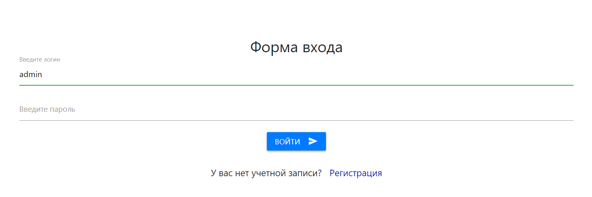
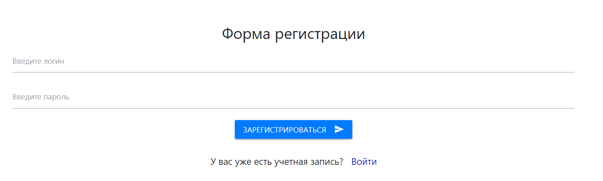
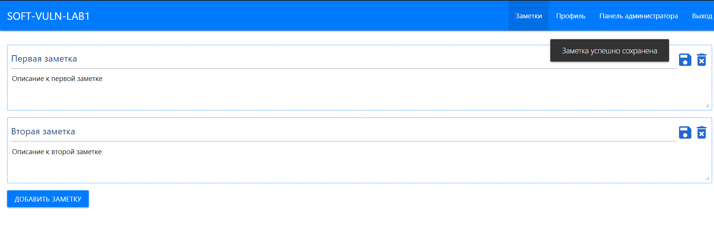

SVLab1
=============================

Сайт на VUE.js + PHP (SPA). Для лабораторной было достаточно 3 функций, поэтому здесь реализована регистрация, авторизация и управление заметками. Профиль и панель администратора не реализованы (только ссылки на них).

Установка
------------

Измените конфигурацию в файле backend/core/config.php и frontend/src/config/*. Выполните в MySQL файл SVLab1.sql. 
Запустите frontend через npm run serve или скомпилируйте в готовую сборку и запустите все запросы на index.html.
Backend запустите любым способом - nginx, apache и т.д.

Скриншоты
------------

